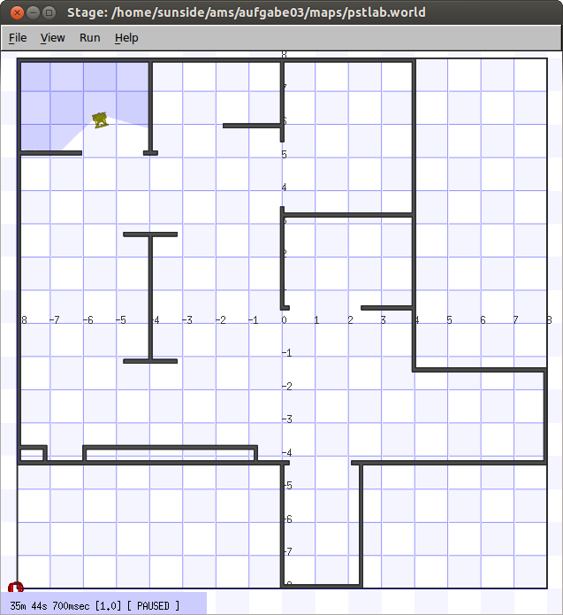
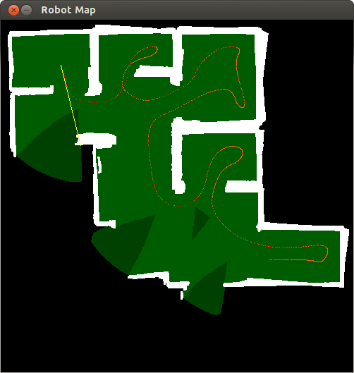
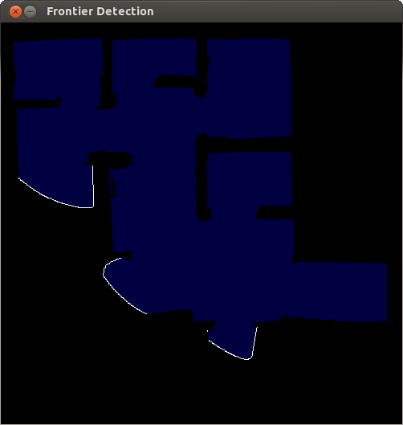

# AMS exploration with Player/Stage

A homework solution for the Autonomous Mobile Systems class at Beuth Hochschule für Technik, Berlin with Prof. Dr. Volker Sommer. Runs a simulation of a [VolksBot](http://www.volksbot.de/) with (error-free) laser rangers.

#### How to compile the code

To compile and run the code, the following requirements must be fulfilled:

* OpenCV (`libopencv-dev`)
* OpenCV highgui (`libopencv-highgui-dev`)
* Player ~ 3.0.2
* Stage ~ 4.0.0

The **easiest way** to compile and start the code is to use [Vagrant](https://www.vagrantup.com/). After installing, simply run

```bash
$ vagrant up
```

in the project directory to bootstrap a virtual machine that is preconfigured with Player/Stage. The VM will be downloaded if it doesn't already exist your local machine (which is likely if you run the command the first time).

Next, connect to the VM using:

```bash
$ vagrant ssh
```

To build the project, do the following:

```bash
$ cd /vagrant
$ make
```

To power down the VM, issue:

```bash
$ vagrant halt
```

You can then `vagrant up` it again later. To permanently remove it, type:

```bash
$ vagrant destroy
$ vagrant box remove sunside/playerstage
```

which will delete the VM, as well as the base image.

#### How to run the code

To run the code, you basically

* start `player pstlab.cfg`
* then start `./simple localhost`

Note that `player` and `./simple` both require an X11 display. On Linux, you may try passing your `$DISPLAY` environment when connecting via ssh.

##### Integrated VNC with browser frontend

For convenience, a dummy Xorg with fluxbox, as well as a noVNC server is started when the VM boots up. In your browser, you may go to `http://localhost:6080/vnc.html` to connect. Leave the password box empty.

```bash
cd /vagrant
make
player pstlab.cfg &
./simple localhost
```

Should you close the Xterm window, try right-clicking the desktop.

## About the project

### Approach to exploration ###

This implements a simple approach using meshed P controllers for forward and angular velocity in dependance of the distance to the next obstacle. 

You can watch a demo video [here](http://www.youtube.com/watch?v=eAbF3QBGwzA).

[](http://www.youtube.com/watch?v=eAbF3QBGwzA)

### Stage / robot setup ###

The robot is modeled without slippage and measurement errors and sports a differential drive with v-omega control.



### Robot Map window ###

The Robot Map shows the map created by the robot, as well as the past trajectory. The yellow vectors points at the nearest unexplored boundary, using a Manhattan distance measure without paying attention to obstacles. As such, it is measured in air distance, which might be used as a heuristic for A* later on.



### Frontiers and algorithm termination ###

This program implements a frontier-based approach to exploration. A queue-linear flood fill algorithm is used to determine knowledge boundaries (white), i.e. areas that have not been scanned by the robot. The exploration algorithm terminates if no frontiers are left, meaning that the whole terrain has been explored. 



More on frontier-based exploration can be found in e.g. *A Frontier-Based Approach for Autonomous Exploration* by Brian Yamauchi ([http://citeseerx.ist.psu.edu/viewdoc/summary?doi=10.1.1.121.2826](http://citeseerx.ist.psu.edu/viewdoc/summary?doi=10.1.1.121.2826))

```bibtex
@INPROCEEDINGS{Yamauchi97afrontier-based,
    author = {Brian Yamauchi},
    title = {A frontier-based approach for autonomous exploration},
    booktitle = {In Proceedings of the IEEE International Symposium on Computational Intelligence, Robotics and Automation},
    year = {1997},
    pages = {146--151}
}
```